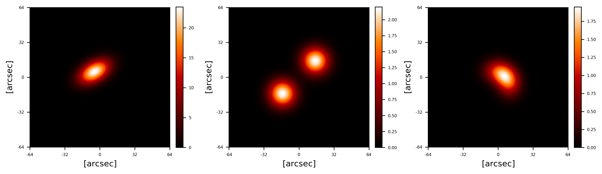
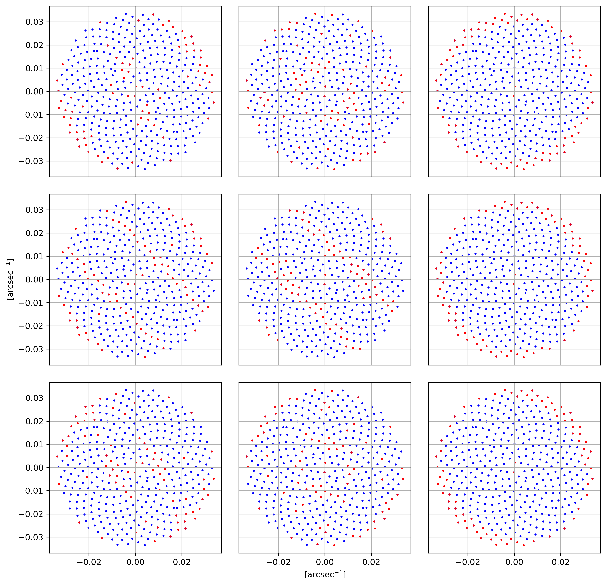
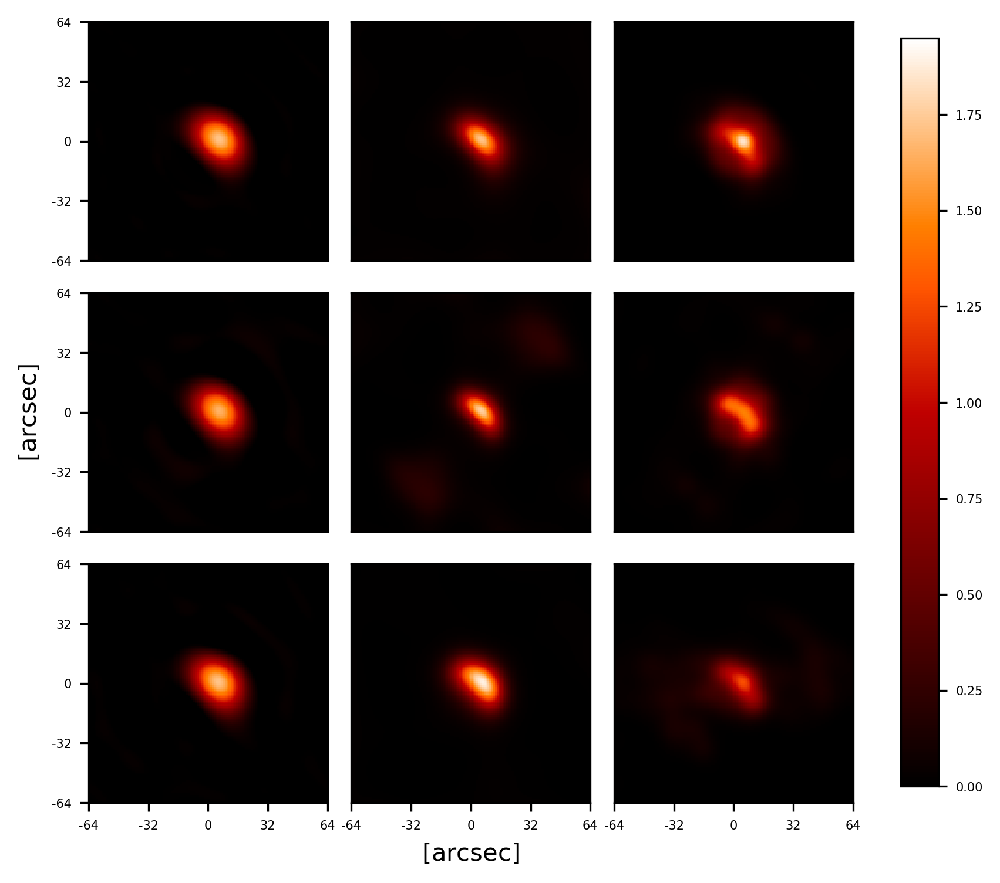

# GreedyIP
# Brief description
This repository contains the code developed to study greedy point selection (specifically residual-based and error-based strategies) applied to image reconstruction using different inversion methods.
The framework allows you to:

- simulate different flare configurations (e.g., one source, two sources, etc.)

- apply various targeted subsampling strategies

- reconstruct the image using different inversion methods

- compare the resulting reconstruction metrics

# Example workflow

## 1. Simulated flare configurations

Synthetic solar-flare scenarios generated using the `simulator.py` module.

  <strong>Ground-truth emission models.</strong>

## 2. Greedy points selection  
Residual-based and error-based strategies used to select informative points.  

  

  <strong>UV sampling and f-greedy selected points across configurations and strategies.</strong>

## 3. Reconstruction from selected visibilities  
Reconstruction obtained from full sampling, p-greedy points, and f-greedy points using different inversion methods.  

  

  <strong>Example reconstruction (Loop configuration).</strong>

## 4. Reconstruction metrics

To evaluate the reconstruction quality across different sampling strategies and inversion methods, the framework computes standard quantitative metrics, including:

- **χ² (Chi-square)** — discrepancy between observed and model visibilities  
- **RMSE (Root Mean Square Error)** — absolute reconstruction error  
- **MRE (Mean Relative Error)** — relative reconstruction error  

# Contents
This repository contains a demo for greedy selection of visibilities and UV interpolation using kernel-based methods. The demo allows simulating different types of solar flares, generating the corresponding visibilities, and performing greedy selection and reconstruction via different reconstruction methods
## Files overview
- "**Kernel_utilities**".py:
Utility functions for kernel interpolation and feature construction:
- "**greedy_utilities.py**":
Implements greedy selection of visibilities
- "**uv_smooth.py**":
Functions for UV interpolation and reconstruction
- "**simulator.py**":
Functions for simulating flare sources and generating visibilities or Fourier matrices for testing and demo purposes.

# Citations
If you use this code please cite

> L. Bruni Bruno, P. Massa, E. Perracchione, M. Trombini, Greedy methods in inverse problems, in preparation 2025
